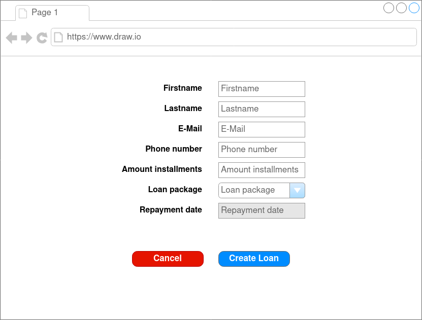
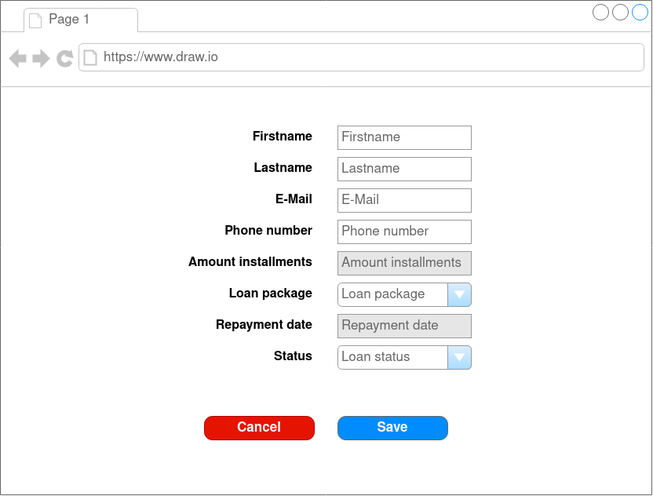

# m307-project

## Sitemap

| Name   | Route   | content                                     |
|--------|---------|---------------------------------------------|
| Home   | /       | Navigation (links to the list and creation) |
| List   | /list   | Loans overview                              |
| Create | /create | Creation of loans                           |
| Edit   | /edit   | Editing/updating loans                      |

## Forms

### Create

### Edit

## Validation

### Create Form

| Field-Name | Route | 
|--------|---------|
| name   | not empty, no special characters, no numbers |
| lastname | not empty, no special characters, no numbers  |
| e-mail | not empty, valid e-mail |
| phone number | can be empty, only numbers, whitespace and + |
| amount installments | not empty, only numbers (integer), no whitespaces, 1-10 |
| loan package | not empty, only values from the list of available loan packages  |

### Edit Form

| Filename | Route| | Field-Name | Route | |--------|---------| | name | no | name | not empty, no special characters,
no numbers | | lastname | not empty, no special characters, no numbers | | e-mail | not empty, valid e-mail | | phone |
not empty, only numbers and + | | loan package | not empty, only numbers, no whitespaces, no numbers | | status |
boolean: true - the loan has been fully repaid, false - the loan has not been repaid yet |

## Database

### loan

| Field-Name | Datatype | 
|--------|---------|
| id_person | INT, PRIMARY KEY, A.I |
| name | Varchar(100), NOT NULL |
| lastname | Varchar(100), NOT NULL |
| email | Varchar(100), NOT NULL |
| phone_number | Varchar(100), NOT NULL |
| installments | INT, NOT NULL |
| fk_creditpackages_id | INT, FOREIGN KEY, NOT NULL |
| paid_back | BOOL, NOT NULL, DEFAULT = false |
| start_date | Datetime, DEFAULT = NOW |

### creditpackage

| Field-name | Datatype | 
|--------|---------|
| id_creditpackage | INT, PRIMARY KEY, A.I | 
| name | Varchar(100), NOT NULL | 

## Test cases

Project for ÜK Modul 307

### 1. test case

| State | Action | 
|--------|---------|
| Given | I've connected with the /create route and the form is showing. | 
| When | I fill the form with the following information:   name: Max   lastname: Mustermann   e-mail: max.mustermann@sluz.ch   phone: +41 77 449 75 00   loan package: example package 1000   amount of installments: 2   I click on the create button. | 
| Then | A new loan is created and saved in the database. | 

### 2. test case

| State | Action | 
|--------|---------|
| Given | I've connected with the /create route and the form is showing. | 
| When | I fill the form with the following information:   name: Max   lastname: Mustermann   e-mail: <b>max.mustermann@sluz</b>   phone: +41 77 449 75 00   loan package: example package 1000   amount of installments: 2   I click on the create button. | 
| Then | The loan is not created and an error message is shown which states that the E-Mail is not valid. | 

### 3. test case

| State | Action | 
|--------|---------|
| Given | I've connected with the /create route and the form is showing. | 
| When | I fill the form with the following information:   name: ``   lastname: Mustermann   e-mail: max.mustermann@sluz.ch   phone: +41 77 449 75 00   loan package: example package 1000   amount of installments: 2   I click on the create button. | 
| Then | The loan is not created and an error message is shown which states that the name field contains invalid characters. |

### 4. test case

| State | Action | 
|--------|---------|
| Given | I am on the site "/". | 
| When | I navigate to the site with the route "/list". | 
| Then | The correct view for the route "/list" is shown. |

### 5. test case

| State | Action | 
|--------|---------|
| Given | I am on the view for the "/list" route and there is at least one loan. | 
| When | I click on the "edit"-button which belongs to one of the loans. | 
| Then | The view for the "/edit" route shows up in the browser. |

### 6. test case

| State | Action | 
|--------|---------|
| Given | I am on the view for the "/edit" route. | 
| When | I change the value in the name field and click on save. | 
| Then | The data is updated in the database. | 

### 7. test case

| State | Action | 
|--------|---------|
| Given | I am on the view for the "/edit" route. | 
| When | I change the value in the name field to "Max¦@°°§¬¬123" and click on save. | 
| Then | The data is not updated in the database and an error message is shown which states that the name is not valid. |

### 8. test case

| State | Action | 
|--------|---------|
| Given | I am on the view for the "/" route. | 
| When | I change the URL manually to /edit. | 
| Then | The site I tried to reach is not shown (422-Unprocessable Entity). | 

### 9. test case

| State | Action | 
|--------|---------|
| Given | I am on the view for the "/edit" route. | 
| When | I press the "cancel"-button. | 
| Then | The view for the route "/list" shows up. |

### 10. test case

| State | Action | 
|--------|---------|
| Given | I am on the view for the "/" route. | 
| When | I change the URL to "/dfjklsfjklas". | 
| Then | The site I tried to reach is not shown (404-Site not found). | 

